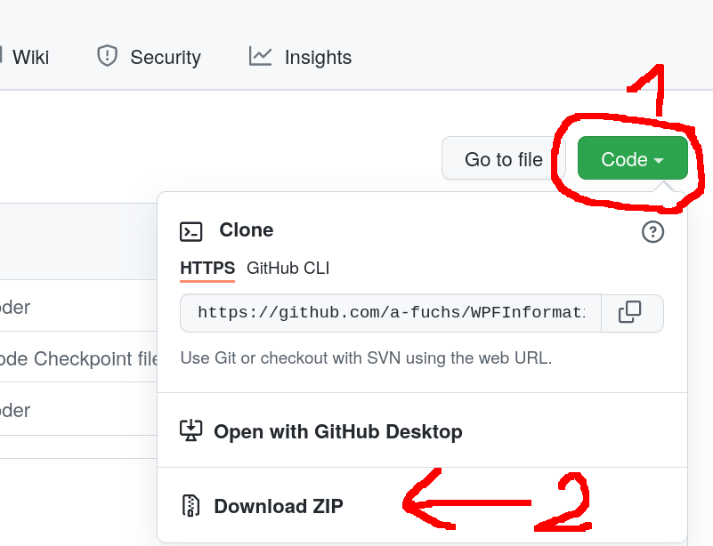

# Wahlpflichfach Informatik 12 Technik

* [Python und MicroPython](jupyter/index.ipynb)
* [Cinderella](cinderella/index.ipynb)

---
## Download des Skripts und der zugehörigen Dateien
* Die ZIP-Datei [WPFInformatik-main.zip](https://github.com/a-fuchs/WPFInformatik/archive/refs/heads/main.zip) direkt herunterladen, oder wie im Screenshot
 .  
 Falls Sie `git` installiert haben: am besten initial mit `git clone https://github.com/a-fuchs/WPFInformatik`.
* WPFInformatik-main.zip **entpacken**, den **entpackten** Ordner `WPFInformatik-main` in `WPFInformatik` umbennen und dann an den Platz ihrer Wahl schieben (z.B. OneDrive der Schule).

---
## Installation von [JupyterLab](https://jupyter.org/)
### Windows
* Zur Installation ist [Python](https://www.python.org) notwendig.  
  Dieses muss unter Windows erst noch installiert werden (zum [Download](https://www.python.org/downloads/)).
  
* Um die Microcontroller ansprechen zu können sind unter Windows die
  **USB-Treiber** zu **installieren**.  
  Diese liegen im zuvor heruntergeladenen Ordner unter `WPFInformatik/jupyter/000_InstallAndSetup/WindowsDriver`, oder [hier](https://github.com/a-fuchs/WPFInformatik/tree/main/jupyter/030_InstallAndSetup/WindowsDriver)).  
  Achtung: die Treiber müssen vorher noch entpackt werden!

* Die Datei `setupJupyterLabWindows.bat`  
  vom Ordner `WPFInformatik/jupyter/000_InstallAndSetupJupyter/`, oder [hier](https://github.com/a-fuchs/WPFInformatik/blob/main/jupyter/030_InstallAndSetup/Jupyter/setupJupyterLabWindows.bat),  
  in einen Ordner Ihrer Wahl kopieren,  
  z.B. `C:\Users\ich\Documents\schule` und doppelklicken.  
  In **dem** Ordner, in **dem `setupJupyterLabWindows.bat`** liegt, wird nun automatisch ein
     Ordner `jupyter` angelegt, also im Beispiel
     `C:\Users\ich\Documents\schule\jupyter` (_Achtung_: dauert eine Weile!).
* In **diesen neu angelegten** Ordner `juypter` (im Beispiel: `C:\Users\ich\Documents\schule\jupyter`)  kopieren Sie anschliessend die Datei `startJupyterLab.bat`  
  vom Ordner `WPFInformatik/jupyter/000_InstallAndSetupJupyter/`, oder [hier](https://github.com/a-fuchs/WPFInformatik/blob/main/jupyter/030_InstallAndSetup/Jupyter/startJupyterLab.bat).  
     Im Beispiel ergibt sich:
     `C:\Users\ich\Documents\schule\jupyter\startJupyterLab.bat`.  
     **Diese Datei** ist es, die sie zum **Starten von JupyterLab** ausführen müssen!
###
### Linux
* Kopieren der `setupJupyterLabLinux.sh` in den Ordner `~/lib` (diesen eventuell noch anlegen)  
  und dort ausführen.
  Die `startJupyterLab.sh` nach `~/bin` kopieren und **unbedingt** den Ordner-Pfad anpassen!
---      
## Start von JupyterLab      
### Wichtig!
* Wenn Sie das OneDrive der Schule verwenden, **muss der Ordner `WPFInformatik`** (siehe auch oben) dort auch **erreichbar** sein!  
  Jupyter hängt sich sonst gerne auf. Einfachste Abhilfe in diesem Fall:  
  Neustart des Rechners, oder alle `nodejs`-Prozesse killen.
* Wenn Sie einen **anderen Platz** verwenden wollen **müssen** sie im Beispiel für Windows die Datei 
   `C:\Users\ich\Documents\schule\jupyter\startJupyterLab.bat` **anpassen:**  
   statt: `jupyter-lab --notebook-dir "%OneDrive%\WPFInformatik\jupyter"`  
   `jupyter-lab --notebook-dir "Ordner Ihrer Wahl"`  
   (unter Linux die Datei `~/bin/startJupyterLab.sh`).
  
  
### Windows
**Im Beispiel** von oben:
* **Starten:** Doppelcklick auf die `startJupyterLab.bat` im  Verzeichnis  
  `C:\Users\ich\Documents\schule\jupyter`  
  startet nun Juypter-Lab.
  
* **Beenden:** Schliessen des "schwarzen Fensters" (DOS-Console) beendet Jupyter-Lab.
   
### Linux
*  **Starten** mit `~/bin/startJupyterLab.sh`.
*  **Beenden** mit CTRL-C in der entsprechende Shell.

#==============================================================================
